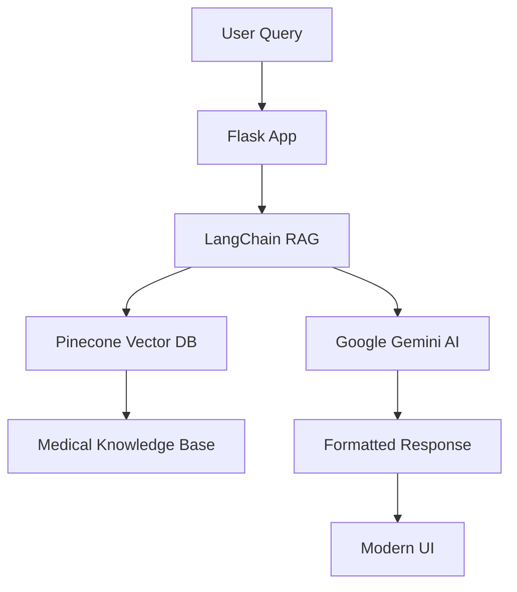

# 🩺 MediGPT - AI Medical Assistant

<div align="center">


*An intelligent medical chatbot powered by RAG architecture and Google's Gemini AI*

[🚀 Live Demo](https://your-app.railway.app) • [📖 Documentation](#features) • [🛠️ Setup](#installation)

</div>

## ✨ Features

### 🤖 **AI-Powered Medical Assistance**
- **RAG Architecture**: Retrieval-Augmented Generation for accurate medical responses
- **Medical Knowledge Base**: Trained on comprehensive medical literature
- **Context-Aware**: Understands medical terminology and conditions
- **Real-time Responses**: Instant medical information and guidance

### 🎨 **Modern UI/UX**
- **Responsive Design**: Works seamlessly on desktop, tablet, and mobile
- **Dark/Light Theme**: Toggle between themes with preference saving
- **Medical Branding**: Professional healthcare-focused design
- **Interactive Elements**: Smooth animations and hover effects
- **Quick Actions**: Pre-defined medical query buttons

### 🔧 **Technical Features**
- **Formatted Responses**: Markdown support with medical-specific styling
- **Error Handling**: Comprehensive error management and logging
- **Session Management**: Secure user sessions
- **Clear Chat**: Reset conversation functionality
- **Vector Search**: Pinecone-powered similarity search

## 🏗️ Architecture



## 🚀 Quick Start

### Prerequisites
- Python 3.8+
- Pinecone API Key
- Google AI API Key

### Installation

1. **Clone the repository**
   ```bash
   git clone https://github.com/yourusername/MediGPT.git
   cd MediGPT
   ```

2. **Install dependencies**
   ```bash
   pip install -r requirements.txt
   ```

3. **Environment Setup**
   ```bash
   # Create .env file
   PINECONE_API_KEY=your_pinecone_api_key
   GOOGLE_API_KEY=your_google_api_key
   SECRET_KEY=your_secret_key
   ```

4. **Run the application**
   ```bash
   python app.py
   ```

5. **Access the app**
   ```
   http://localhost:8080
   ```

## 🚂 Railway Deployment

### One-Click Deploy
[](https://railway.app/template/your-template)

### Manual Deployment

1. **Connect Repository**
   - Link your GitHub repository to Railway
   - Railway will auto-detect the Flask app

2. **Environment Variables**
   ```env
   PINECONE_API_KEY=your_pinecone_api_key
   GOOGLE_API_KEY=your_google_api_key
   SECRET_KEY=your_secret_key
   PORT=8080
   ```

3. **Deploy**
   - Railway automatically builds and deploys
   - Your app will be available at `https://your-app.railway.app`

## 📁 Project Structure

```
MediGPT/
├── 📄 app.py                 # Main Flask application
├── 📁 src/
│   ├── 📄 helper.py          # Utility functions
│   └── 📄 prompt.py          # System prompts
├── 📁 templates/
│   └── 📄 chat.html          # Frontend template
├── 📁 static/
│   └── 📄 style.css          # Modern CSS styles
├── 📁 data/                  # Medical knowledge base
├── 📄 requirements.txt       # Dependencies
├── 📄 .env                   # Environment variables
└── 📄 README.md             # This file
```

## 🛠️ Tech Stack

| Component | Technology |
|-----------|------------|
| **Backend** | Flask 3.1.1 |
| **AI Framework** | LangChain 1.0.3 |
| **LLM** | Google Gemini 2.5 Flash |
| **Vector DB** | Pinecone |
| **Embeddings** | Sentence Transformers |
| **Frontend** | HTML5, CSS3, JavaScript |
| **Deployment** | Railway |

## 🎯 Usage Examples

### Medical Queries
```
🩺 "What are the symptoms of diabetes?"
💊 "How to treat high blood pressure?"
🫀 "What causes heart disease?"
🧬 "Explain the side effects of aspirin"
```

### Features Demo
- **Theme Toggle**: Click 🌙/☀️ to switch themes
- **Clear Chat**: Click 🧹 to reset conversation
- **Quick Actions**: Use predefined medical query buttons
- **Formatted Responses**: Medical sections, highlights, and emphasis

## 🔒 Security & Privacy

- **No Data Storage**: Conversations are not permanently stored
- **Secure Sessions**: Flask session management
- **API Key Protection**: Environment variable security
- **Medical Disclaimer**: Clear usage guidelines

## ⚠️ Medical Disclaimer

> **Important**: MediGPT provides general medical information only. Always consult qualified healthcare professionals for medical advice, diagnosis, or treatment. This AI assistant is not a substitute for professional medical care.

## 🤝 Contributing

1. Fork the repository
2. Create a feature branch (`git checkout -b feature/amazing-feature`)
3. Commit changes (`git commit -m 'Add amazing feature'`)
4. Push to branch (`git push origin feature/amazing-feature`)
5. Open a Pull Request

## 📝 License

This project is licensed under the MIT License - see the [LICENSE](LICENSE) file for details.

## 🙏 Acknowledgments

- **LangChain** for the RAG framework
- **Google AI** for Gemini language model
- **Pinecone** for vector database
- **Railway** for seamless deployment

---

<div align="center">

**Made with ❤️ for better healthcare accessibility**

[⭐ Star this repo](https://github.com/yourusername/MediGPT) • [🐛 Report Bug](https://github.com/yourusername/MediGPT/issues) • [💡 Request Feature](https://github.com/yourusername/MediGPT/issues)

</div>